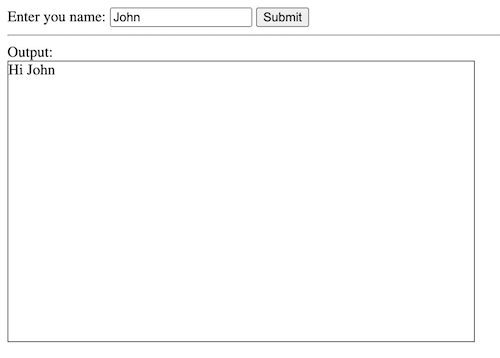

# Pracetice 1: innerHTML

## Requirements
1. A text field that you can enter your name into.
2. A submit button.
3. Assume you enter "John". After clicking the submit button, show "Hi John" in the output textarea box.

## Result

