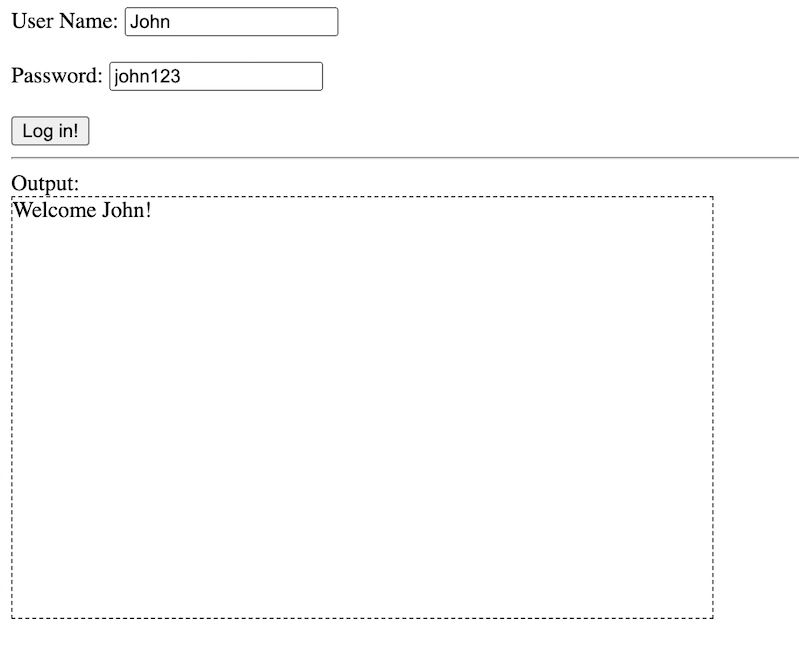
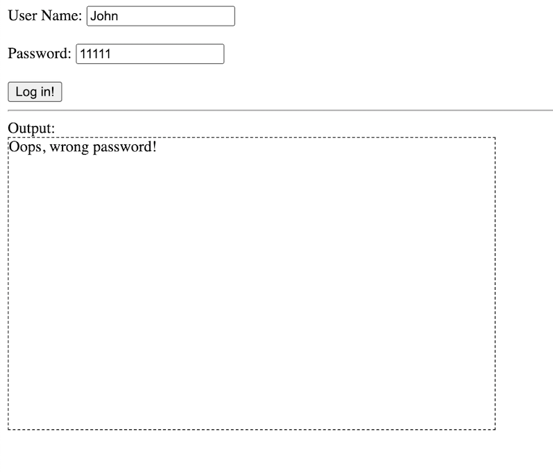

# Pracetice 2: Check Password

## Requirements
1. Two text fields which can be entered username and password.
2. A submit button.
3. Enter username and password and click the submit button, and check
    if the entered password is correct. Display result message in the output area.
    - If correct, dispay "Welcome John!" (assume the entered username is "John")
    - If incorrect, dispay "Oops, wrong password!"

P.S. Assume there are only 3 users:
| username | password    |
|:--------:|:-----------:|
| John     | john123     |
| Ann      | a456        |
| Mike     | password789 |

## Result

## Answer Code

(TBC)
