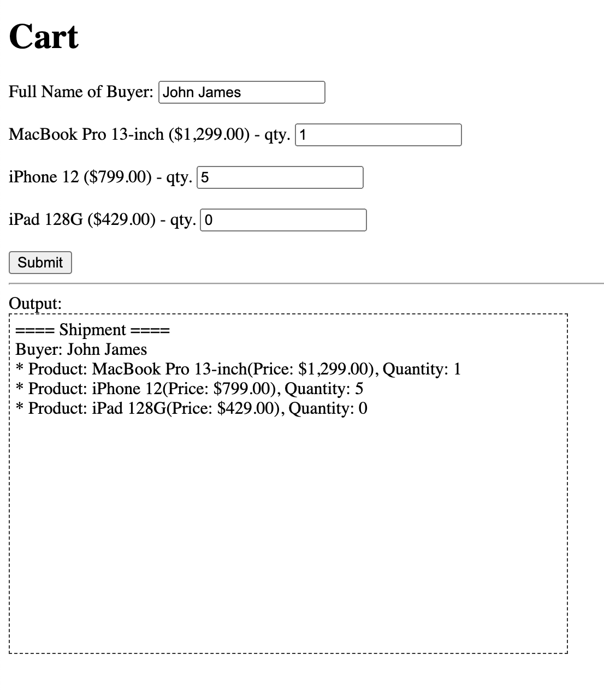

# Practice 3: Shipment

## Requirements
1. Allow user to enter buyer name and modify the quantity of prodcuts in cart.
2. When clicking submit button, display a shipment in the output area.
3. Example of shipment:
```
==== Shipment ====
Buyer: John James
* Product: MacBook Pro 13-inch(Price: $1,299.00), Quantity: 1
* Product: iPhone 12(Price: $799.00), Quantity: 2
* Product: iPad 128G(Price: $429.00), Quantity: 0
```

## Result



## Answer Code

(TBC)
