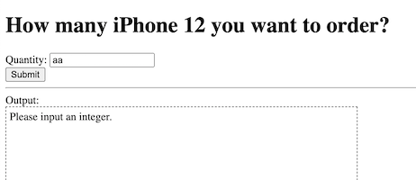

# Practice 4: Is Number?

## Requirements
Check if the user input is a number.

(Is a number)

(Not a number)

## References
* [JavaScript test() Method - W3Schools](https://www.w3schools.com/jsref/jsref_regexp_test.asp)
* [RegExp.prototype.test() - JavaScript | MDN](https://developer.mozilla.org/en-US/docs/Web/JavaScript/Reference/Global_Objects/RegExp/test)

## Answer

* [code](./practice4_isNumber.html)
